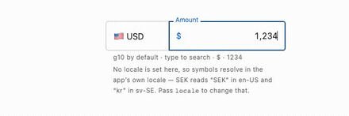
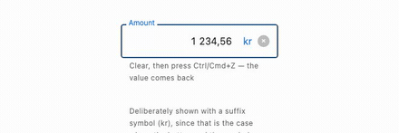
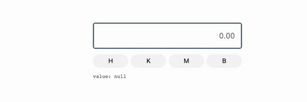

# react-financial-input

[](https://github.com/david-chau/react-financial-input/actions/workflows/ci.yml)
[](https://www.npmjs.com/package/react-financial-input)
[](https://bundlejs.com/?q=react-financial-input)
[](./LICENSE)

A React currency input that formats as you type, with `h`/`k`/`m`/`b` multiplier
shortcuts that work on **every device, including phones**.

Zero runtime dependencies. Unstyled by default.

## Quick start

```bash
npm install react-financial-input
```

```tsx
import { FinancialInput } from 'react-financial-input';

<FinancialInput value={amount} onChange={setAmount} />;
```

That is the whole API for the common case. `onChange` receives a `number`, or
`null` while the value is incomplete — an empty input, or a lone `.` part-way
through typing. Never `NaN`.

Already storing text? Ask for it back:

```tsx
<FinancialInput valueType="string" value={raw} onChange={setRaw} />
```

`onChange` then hands back canonical text — `"1234.56"`, no grouping, always a
`.` fraction, whatever the locale — so it is safe to POST as-is.

React 18 or 19 as a peer dependency. Nothing else.

Want it styled? One import, opt-in:

```tsx
import 'react-financial-input/styles.css';
```

**[Open the playground in StackBlitz →](https://stackblitz.com/github/david-chau/react-financial-input/tree/main/examples/playground)**
· **[Browse every state in Storybook →](https://david-chau.github.io/react-financial-input/)**
· **[Framework examples →](EXAMPLES.md)**

## What it does

### Typing

|                            |                                             |
| -------------------------- | ------------------------------------------- |
| Digits group as you type   |  |
| `2.5m` expands to millions |          |

### Editing

|                                 |                                                   |
| ------------------------------- | ------------------------------------------------- |
| Backspace across a separator    |  |
| Paste is sanitised, not refused |              |
| Undo, one step per edit         |       |

Undo is the component's own, so a paste or an expansion comes back in a single
step rather than unwinding character by character.

### Currency

|                                   |                                            |
| --------------------------------- | ------------------------------------------ |
| Symbol and separators from `Intl` |  |
| Search, for when 162 is the list  |    |

`locale: 'de-DE'` gives `1.234,56`. `currency: 'SEK'` resolves the symbol **and**
which side it belongs on. Symbols follow the **locale**, not the currency: SEK
reads `SEK` in `en-US` and `kr` only in `sv-SE`.

### Feedback and extras

|                                      |                                                         |
| ------------------------------------ | ------------------------------------------------------- |
| Refused keystrokes flash             |           |
| Clear button, undoable               |  |
| Multiplier keys for a numeric keypad |  |

The clear button, the keys, the currency picker and the floating label are all
**off by default** — the component renders a bare `<input>`. The hook gives you
the behaviour; you render the markup.
See [the extras](DESIGN.md#off-by-default-extras).

## Why this one

- **Shortcuts work on mobile.** Most currency inputs ask for a numeric keypad,
  which has no letter keys — so `2.5m` is impossible to type on a phone.
  ([why](DESIGN.md#why-the-keyboard-defaults-to-text-on-mobile))
- **Built on `InputEvent`, not key codes.** Soft keyboards often send no key
  code at all. ([how](DESIGN.md#how-input-is-handled))
- **The awkward paths are handled.** Paste, drag-drop, cut, word delete and
  Android IME composition each have a case, not a shrug.
  ([cheatsheet](DESIGN.md#input-event-cheatsheet))
- **Tested on real hardware.** Two bugs — an Android caret jump and Samsung
  deferring `compositionend` — only appeared on physical phones, and are now
  recorded traces in the test table.

## Props

Every native `<input>` prop is passed through (`placeholder`, `disabled`,
`name`, `onBlur`, `aria-*`), and `ref` is forwarded.

| Prop                       | Type                               | Default         | Description                                                                   |
| -------------------------- | ---------------------------------- | --------------- | ----------------------------------------------------------------------------- |
| `value`                    | `number \| string \| null`         | `undefined`     | Typed by `valueType`. A string may be canonical, display, or `2.5m`.          |
| `onChange`                 | `(value: number \| string \| null) => void` | —      | The number, or canonical text — never the formatted string.                   |
| `valueType`                | `'number' \| 'string'`             | `'number'`      | Which of the two `value` and `onChange` speak.                                |
| `onError`                  | `() => void`                       | —               | Called when a keystroke is refused.                                           |
| `options.scale`            | `number`                           | `2`             | Maximum decimal places. `0` refuses the decimal point.                        |
| `options.maxDigits`        | `number`                           | `11`            | Maximum integer digits.                                                       |
| `options.locale`           | `string`                           | —               | BCP 47 tag. Supplies separators and the currency symbol.                      |
| `options.currency`         | `string`                           | —               | ISO 4217 code. The symbol is returned, not put in the value.                  |
| `options.groupSeparator`   | `string`                           | `','`           | Overrides the locale.                                                         |
| `options.decimalSeparator` | `string`                           | `'.'`           | Overrides the locale.                                                         |
| `options.shortcuts`        | `Record<string, number>`           | `h`/`k`/`m`/`b` | Characters to multipliers. Must be powers of ten.                             |
| `options.range`            | `'ALL' \| 'POSITIVE'`              | `'ALL'`         | `'POSITIVE'` refuses negatives.                                               |
| `options.inputMode`        | `'text' \| 'decimal' \| 'numeric'` | `'text'`        | Which keyboard mobile raises.                                                 |
| `options.flashOnError`     | `boolean`                          | `true`          | Flash on a refused keystroke. Colour only; add `rfi-input--shake` for motion. |

### Shortcuts

| Key | Multiplier     |
| --- | -------------- |
| `h` | ×100           |
| `k` | ×1,000         |
| `m` | ×1,000,000     |
| `b` | ×1,000,000,000 |

Typing one on its own reads as one of that unit, so `k` gives `1,000`. Override
with `options.shortcuts`.

## Headless

Keep the formatting and validation, bring your own input:

```tsx
import { useFinancialInput } from 'react-financial-input';

const { getInputProps } = useFinancialInput({ value, onChange: setValue });

<TextField slotProps={{ htmlInput: getInputProps() }} />; // MUI
<Input {...getInputProps()} />; // Chakra
```

The hook returns everything the extras are built from:

| Returned                       | For                                              |
| ------------------------------ | ------------------------------------------------ |
| `getInputProps()`              | Spread onto any input                            |
| `applyShortcut(character)`     | Multiplier tap targets                           |
| `clear()`                      | A clear button. Undoable, like any other edit    |
| `symbol`, `symbolPosition`     | The currency symbol and which side it belongs on |
| `numericValue`, `displayValue` | The committed number, and what is on screen      |
| `canonicalValue`               | The string to send onward — no grouping, `.` fraction |

## Without React

`parseAmount('$1,234.56 USD')` gives `1234.56`, and `parseAmount('2.5m')` gives
`2500000` — the same rules the input applies to a paste, as one call, with no
DOM. Currency lists, search and flag emoji come from `Intl` rather than a
bundled table.

All of it is in **[UTILS.md](UTILS.md)**.

## Docs

- **[EXAMPLES.md](EXAMPLES.md)** — Next.js, React Hook Form, Formik, MUI,
  Chakra, TanStack Form, plain forms, and how to test it.
- **[UTILS.md](UTILS.md)** — the non-React exports: parsing, formatting,
  currency lists, search, flags.
- **[DESIGN.md](DESIGN.md)** — why it behaves as it does: the mobile keyboard
  trade-off, exact multipliers, the input event cheatsheet, the device support
  matrix, styling.
- **[CONTRIBUTING.md](CONTRIBUTING.md)** — architecture rules and local setup.
- **[CI.md](CI.md)** — what each workflow does, and how to publish.

## License

MIT
